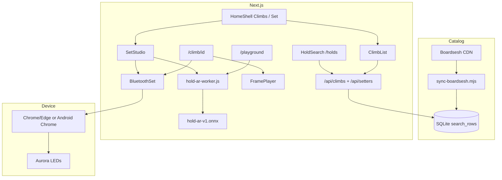

# Architecture — Kilterboard v1.1.3

How the app is put together: data flow, layers, and constraints.  
Agent rules: `COPILOT.md`. Local AI: **`AI.md`**.

## Purpose

1. **Browse** Kilter 12×12 kickboard climbs (Boardsesh).  
2. **Search by holds** — boulders only (`/holds`).  
3. **Set** custom boulders/routes (+ drafts, paint rules).  
4. **Light** a physical Aurora/Kilter board (Web Bluetooth).  
5. **Generate** boulders locally with **Hold AR** (ONNX transformer in Web Worker).

## High-level flow

## Layers

### 1. Climb catalog (Boardsesh)

| Step | Detail |
|------|--------|
| Source | Boardsesh CDN snapshots (Kilter layout **1**) |
| Filter | listed, not draft, size **10** |
| Local | `data/boardsesh/kilter-12x12.db` + `.gz` (gitignored) |
| Pin | committed `manifest-entry.json` / `manifest.json` (`builtAt`) |
| Fast path | Denormalized **`search_rows`** |
| Sync | `sync-boardsesh.mjs` stale-aware (`builtAt`); `--force` / `--check-only` |
| Local auto | `predev` → `ensure-boardsesh-db.mjs` |
| Prod auto | build ensure + GH Action **every 6h** → Vercel Deploy Hook if pin stale |

### 2. HTTP API

| Route | Role |
|-------|------|
| `GET /api/climbs` | Filters + pagination over `search_rows` |
| `GET /api/climbs?holds=1,2,3` | AND match all placements (`p{id}r` in frames); forces **boulders** |
| `GET /api/setters?q=` | Setter autocomplete |

Runtime: **Node only** (`node:sqlite`). Grades: difficulty 10–33 → Font/V.

### 2b. Hold search (`/holds`)

- Dock tab **Holds** · `HoldSearch` + `HoldPickBoard` (Set-style board layers)
- **Boulders only** (single-frame / `is_route = 0`); multi-frame routes excluded
- Selection is role-agnostic; UI banner states the limitation
- Same secondary filters as Climbs (name, setter, angle, grade, sort, ascents, quality) — **no** boulders/routes type control
- Compact filter chip (`.ui-filter-chip`) beside Name/Setter; collapses on scroll like Climbs

### 2c. Climb list filter state

- **URL on `/`:** non-default filters as query (`name`, `setter`, `angle`, `sort`, `kind`, …) via `ClimbList` `router.replace`
- **`/holds`:** `view=holds` + `holds=` + same filter keys (no `kind`)
- **sessionStorage** `kb:climb-list-qs` — shared restore for back navigation
- **Climb detail:** `buildClimbHref` adds `from=`; `listHrefFromQuery` / `listBackLabel` route holds → `/holds?…`
- Helpers: `lib/climb-list-url.ts`

### 3. Frames & board

Aurora frames: `p{placementId}r{roleId}…`  
Multi-frame: deltas joined by `,"`.  
Roles: 12 start, 13 hand, 14 finish, 15 foot.  
`lib/aurora/board.ts` — parse/encode, SVG coords, LED map.

### 4. Set studio

`components/SetStudio.tsx` — single interactive board, drafts (localStorage), start/finish rules, BLE, **Hold AR generate**.

### 5. Hold AR (local AI)

| Piece | Role |
|-------|------|
| Train | `ml/hold-ar/train.py` — causal Transformer, offline on Boardsesh |
| Export | `export_onnx.py` → `public/ai/boulder/hold-ar-v1.onnx` |
| Runtime | `hold-ar-worker.js` + `onnxruntime-web` WASM (`public/ai/ort/`) |
| Bridge | `lib/ai/boulder-ai.ts` |
| Decode | AR sample + illegal mask (starts/finishes/reach/feet) + polishClimb |
| Layout pack | `models.json` supplies coords / setByPlacement / optional rules |

**No cloud LLM.** Offline train only.

### 6. Playground

`/playground` — generate + paint edit (no feedback labels). Drafts live in Set.

### 7. UI / design

English UI only. Warm dark + violet accent (`globals.css`). Footer shows **v1.0.0** (`lib/version.ts`).

## Constraints

- Node ≥ 22  
- BLE: Chrome/Edge/Android Chrome only  
- Do not commit Boardsesh DB; re-run `sync:climbs`  
- Large assets: ONNX ~33MB + wasm ~11MB (tracked for clone-and-run)

## Non-goals (v1)

- Cloud AI API keys  
- iOS Safari Bluetooth  
- Product UI for remix/freq/cooccur/spatial generators  
- In-app feedback retrain loop (legacy scripts may remain)
