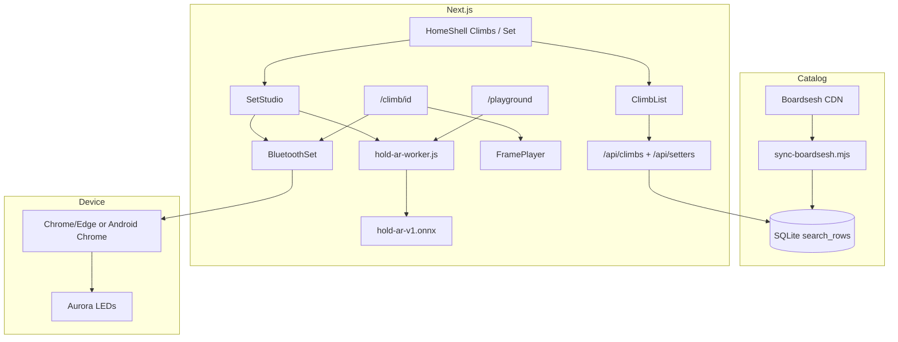

# Architecture — Kilterboard v1.0.0

How the app is put together: data flow, layers, and constraints.  
Agent rules: `COPILOT.md`. Local AI: **`AI.md`**.

## Purpose

1. **Browse** Kilter 12×12 kickboard climbs (Boardsesh).  
2. **Set** custom boulders/routes (+ drafts, paint rules).  
3. **Light** a physical Aurora/Kilter board (Web Bluetooth).  
4. **Generate** boulders locally with **Hold AR** (ONNX transformer in Web Worker).

## High-level flow

## Layers

### 1. Climb catalog (Boardsesh)

| Step | Detail |
|------|--------|
| Source | Daily SQLite from Boardsesh CDN (Kilter layout **1**) |
| Filter | listed, not draft, size **10** |
| Local | `data/boardsesh/kilter-12x12.db` (gitignored) |
| Fast path | Denormalized **`search_rows`** |

### 2. HTTP API

| Route | Role |
|-------|------|
| `GET /api/climbs` | Filters + pagination over `search_rows` |
| `GET /api/setters?q=` | Setter autocomplete |

Runtime: **Node only** (`node:sqlite`). Grades: difficulty 10–33 → Font/V.

### 3. Frames & board

Aurora frames: `p{placementId}r{roleId}…`  
Multi-frame: deltas joined by `,"`.  
Roles: 12 start, 13 hand, 14 finish, 15 foot.  
`lib/aurora/board.ts` — parse/encode, SVG coords, LED map.

### 4. Set studio

`components/SetStudio.tsx` — single interactive board, drafts (localStorage), start/finish rules, BLE, **Hold AR generate**.

### 5. Hold AR (local AI)

| Piece | Role |
|-------|------|
| Train | `ml/hold-ar/train.py` — causal Transformer, offline on Boardsesh |
| Export | `export_onnx.py` → `public/ai/boulder/hold-ar-v1.onnx` |
| Runtime | `hold-ar-worker.js` + `onnxruntime-web` WASM (`public/ai/ort/`) |
| Bridge | `lib/ai/boulder-ai.ts` |
| Decode | AR sample + illegal mask (starts/finishes/reach/feet) + polishClimb |
| Layout pack | `models.json` supplies coords / setByPlacement / optional rules |

**No cloud LLM.** Offline train only.

### 6. Playground

`/playground` — generate + paint edit (no feedback labels). Drafts live in Set.

### 7. UI / design

English UI only. Warm dark + violet accent (`globals.css`). Footer shows **v1.0.0** (`lib/version.ts`).

## Constraints

- Node ≥ 22  
- BLE: Chrome/Edge/Android Chrome only  
- Do not commit Boardsesh DB; re-run `sync:climbs`  
- Large assets: ONNX ~33MB + wasm ~11MB (tracked for clone-and-run)

## Non-goals (v1)

- Cloud AI API keys  
- iOS Safari Bluetooth  
- Product UI for remix/freq/cooccur/spatial generators  
- In-app feedback retrain loop (legacy scripts may remain)
